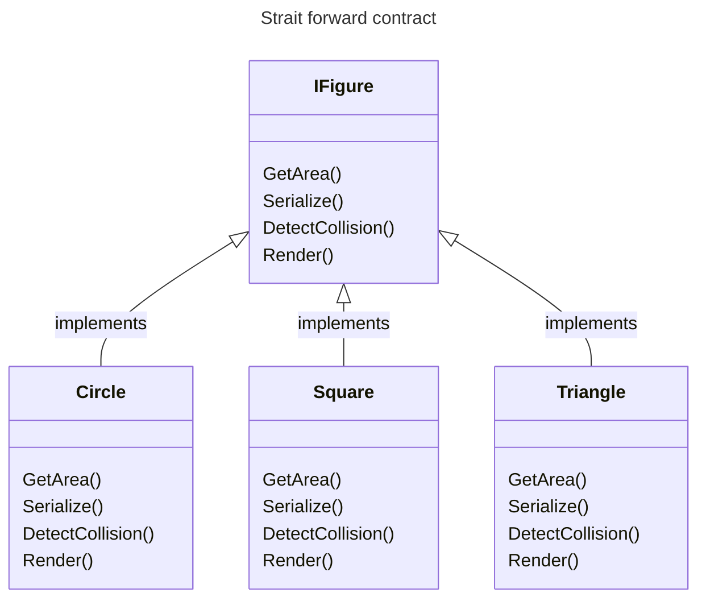

```mermaid
---
title: Strait forward contract
---
classDiagram
    class IFigure {
        GetArea()
        Serialize()
        DetectCollision()
        Render()
    }
    
    class Circle {
        GetArea()
        Serialize()
        DetectCollision()
        Render()
    }
    
    class Square {
        GetArea()
        Serialize()
        DetectCollision()
        Render()
    }
    
    class Triangle {
        GetArea()
        Serialize()
        DetectCollision()
        Render()
    }
      
    IFigure <|-- Circle : implements
    IFigure <|-- Square : implements
    IFigure <|-- Triangle : implements
```

