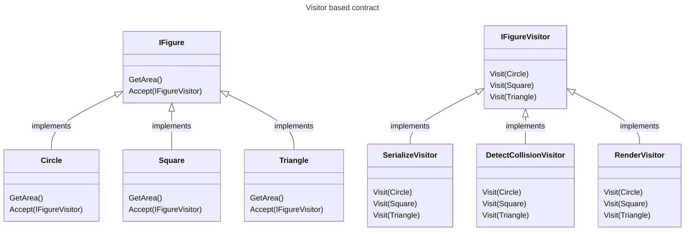

```mermaid
---
title: Visitor based contract
---
classDiagram
      class IFigure {
        GetArea()
        Accept(IFigureVisitor)
      }
      
      class Circle {
        GetArea()
        Accept(IFigureVisitor)
      }
      
      class Square {
        GetArea()
        Accept(IFigureVisitor)
      }
      
      class Triangle {
        GetArea()
        Accept(IFigureVisitor)
      }
      
      class IFigureVisitor {
        Visit(Circle)
        Visit(Square)
        Visit(Triangle)
      }

      class SerializeVisitor {
        Visit(Circle)
        Visit(Square)
        Visit(Triangle)
      }

      class DetectCollisionVisitor {
        Visit(Circle)
        Visit(Square)
        Visit(Triangle)
      }

      class RenderVisitor {
        Visit(Circle)
        Visit(Square)
        Visit(Triangle)
      }

      IFigure <|-- Circle : implements
      IFigure <|-- Square : implements
      IFigure <|-- Triangle : implements
      IFigureVisitor <|-- SerializeVisitor : implements
      IFigureVisitor <|-- DetectCollisionVisitor : implements
      IFigureVisitor <|-- RenderVisitor : implements
```